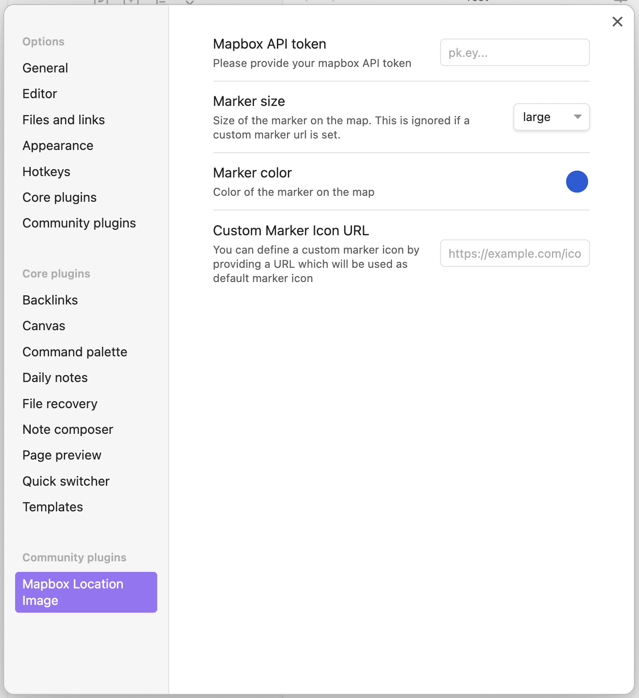
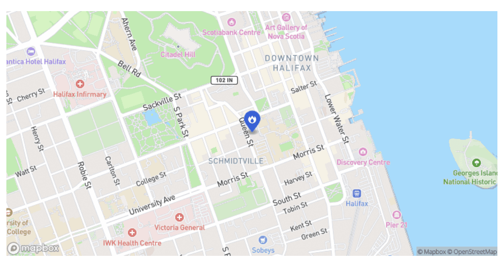
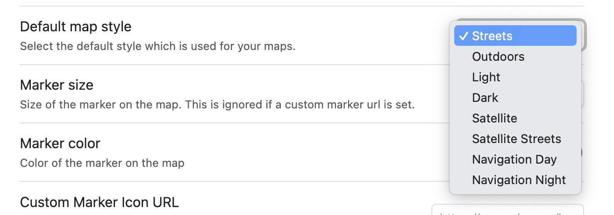
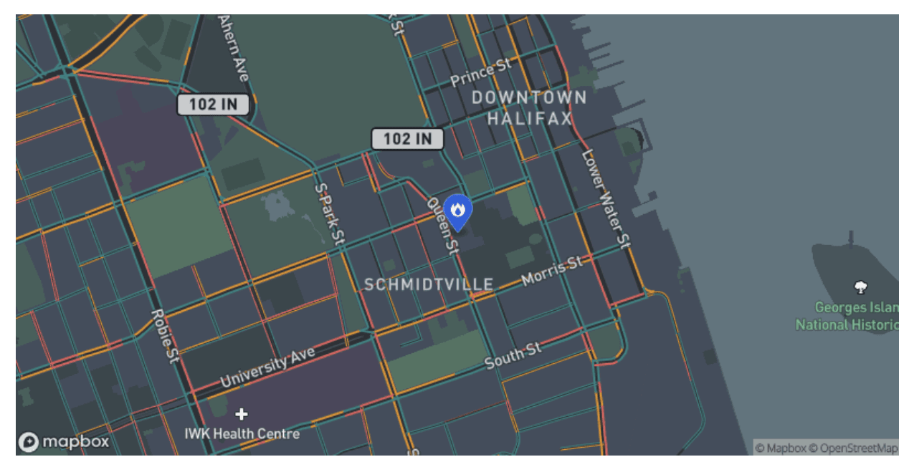

# Documentation

## Installation

For installing the plugin go to the Obsidian settings and click on "Community plugins".  
Click "Browse" and search for "Mapbox Location Image" and click on the "Install" button.

After the install, you need to add your Mapbox API key into the plugin settings. You can get a free API key from [Mapbox](https://www.mapbox.com/).  
To add the API key to your Obsidian settings, go to "Settings" -> "Mapbox Location Image" and paste your API key into the input field.



## Usage

### Basic Usage

You can simply use the code block with `location` as the language identifier. If you provide then longitude and latitude, the plugin will generate a map image for that location.

\```location  
Latitude: 44.64266326577057  
Longitude: -63.57530151565183  
\```

It doesn't matter if you provide the latitude or longitude first. The plugin will recognize the values and generate the map image.  
Also it's not relevant if you write `Latitude` or `latitude` and `Longitude` or `longitude`.

### Changing the icon

There are two options to change the icon. You can either use the marker icon setting in the plugin settings. This will override th icon on all maps globally.  
If you want a custom icon for a specific map, you can add a `marker-url` field to the code block. The value of the field should be the URL to the icon you want to use.

```location
latitude: 44.64266326577057
longitude: -63.57530151565183
marker-url: https://example.com/icon.png
```

If you only want to use one of the [Maki-Icons from Mapbox](https://labs.mapbox.com/maki-icons/) you can do this per code block.

```location
latitude: 44.64266326577057
longitude: -63.57530151565183
maki: fire-station
```

This is the block above rendered with a custom maki icon:


### Change style

You can change the style of the map by selecting a different style in the plugin settings.


This setting changes every map in your vault and is plugin-global.  
To change the style of a map only for a specific map, you can add a `style` field to the code block. The value of the field should be the name of the style you want to use.

```location
latitude: 44.64266326577057
longitude: -63.57530151565183
maki: fire-station
style: navigation-night-v1
```

The result looks like this:


Following values for the code block are supported:

-   streets-v12
-   outdoors-v12
-   light-v11
-   dark-v11
-   satellite-v9
-   satellite-streets-v12
-   navigation-day-v1
-   navigation-night-v1

**Hint**  
Maki icon can only defined in the code block and can't be defined globally. If no custom marker or maki icon is defined, the map falls back to the default marker icon (a home icon).  
If you have defined a custom icon URL (in plugin settings or in your code block) the defined maki icon is ignored.
