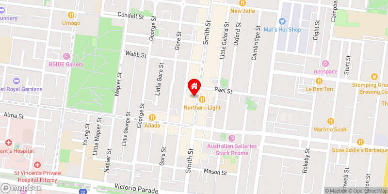

# Obsidian Location Plugin

[](https://github.com/aaronczichon/obsidian-location-plugin/actions/workflows/build.yml)


Welcome to the Obsidian Location Plugin! This plugin allows you to generate location images for your Obsidian notes. You can create a map image of a specific location.

You can simply use the code block with `location` as the language identifier. If you provide then longitude and latitude, the plugin will generate a map image for that location. If you provide a search term the plugin will fetch the most relevant result and generate a map image for that location.

## Example Usage - using coordinates

\```location  
Latitude: 44.64266326577057  
Longitude: -63.57530151565183  
\```

This is how it looks rendered:


## Example Usage - using search term

\```location
search: 123 smith street fitzroy
\```



## Configuration

To make the plugin work, after installation you are required to add your Mapbox API key into the plugin settings. You can get a free API key from [Mapbox](https://www.mapbox.com/).


## Full documentation

The full documentation with all options to configure your map can be found in the [DOCUMENTATION.md](./DOCUMENTATION.md) file.

## Data Privacy

The data privacy information can be found inside the [PRIVACY.md](./PRIVACY.md) file.

## Changelog

Full changelog of the latest versions can be found in the [CHANGELOG.md](./CHANGELOG.md) file.

## Support

If you like the plugin and want to support the development, you can [buy me a coffee](https://buymeacoffee.com/aaronczichon.de).  
[](https://buymeacoffee.com/aaronczichon.de)
