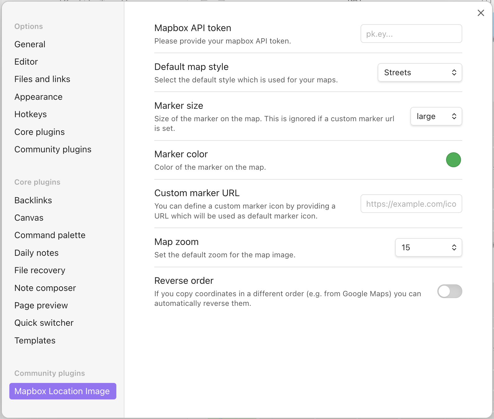

# Getting Started

For installing the plugin go to the Obsidian settings and click on "Community plugins".  
Click "Browse" and search for "Mapbox Location Image" and click on the "Install" button.

After the install, you need to add your Mapbox API key into the plugin settings. You can get a free API key from [Mapbox](https://www.mapbox.com/).  
To add the API key to your Obsidian settings, go to "Settings" -> "Mapbox Location Image" and paste your API key into the input field.

