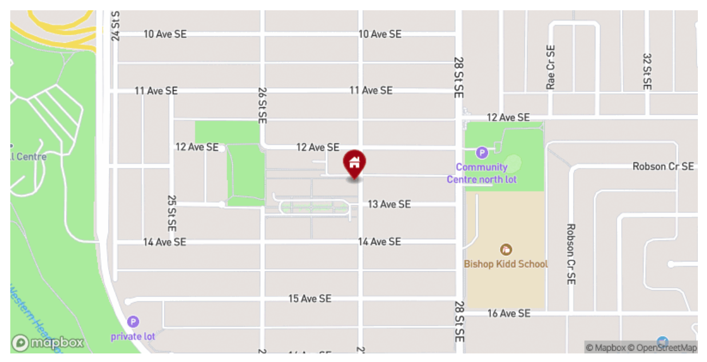

# Basic Usage

Pick a note in your vault and add your first map to it. The plugin works with a specific code block. So if you like to add a map to it, get your coordinates and add a code block like that:

````
```location
[51.0414383239025, -113.9957147847538]
```
````

This will render a nice map like that:

