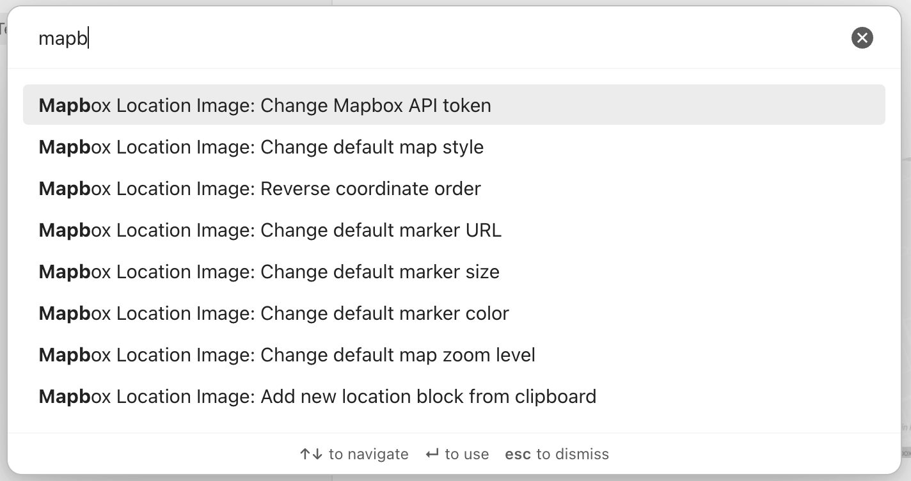

# Commands

:::tip Hint

Commands are only available in Version 2.0.0 and higher.

:::

The plugin comes with 6 build-in commands. 5 of them are a quick option to update settings more easily without going to the settings directly. The last one is a command to add a coordinate string from your clipboard to your current note.

