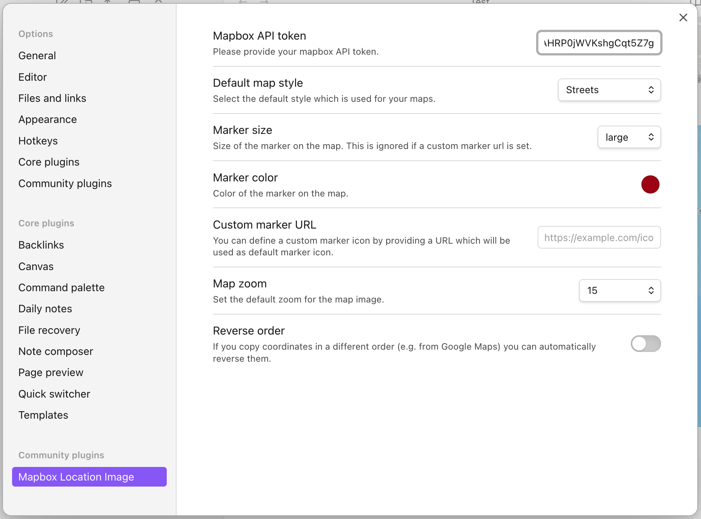

# Settings

There are multiple settings for the plugin available. You can set many of them for all your code blocks in the settings page of the plugin.


Every setting which is set here globally is used by the code blocks if you only provide coordinates/location for the block. You can override these settings for a specific code block by using the keyword for the corresponding setting.
The following list also gives you the keywords to override the setting inside a code block.

## Default map style

The default map style is `streets`. There are 8 map styles you can choose from:

- `streets`
- `outdoors`
- `light`
- `dark`
- `satellite`
- `satellite-streets`
- `navigation-day`
- `navigation-dark`

If you want to override the global plugin setting this is the keyword for the code block: `style`. e.g.

````
```location
[51.0414383239025, -113.9957147847538]
style: outdoors
```
````

## Marker size

This defines how large the marker should be displayed on the rendered map. The options are `small`, `medium` and `large`.
This setting cannot be overriden in the code block and need to be set globally.

## Marker color

Defines which color should be used for the marker. Please use the color picker on the plugin settings to select a color. This setting cannot be overriden in the code block and need to be set globally.

## Custom marker URL

If you don't want to use the default point of interest marker (with an icon) for your marker you can use any picture as marker as you like. You can either provide the URL in the settings page or use the keyword `marker-url:` to use a custom marker.

Hint: If you have set a color or maki icon these will be ignored if you set a custom marker URL.

## Map zoom

Defines how "low" or "high" you want to zoom in or out of the map. The settings page supports values from `1`, `5`, `10`, `15` and `20`.  
You can override this with keyword `zoom:`. The keyword on the code block also supports more values than the predefined of the settings page. You can even use decimal numbers like `6.7` there!

## Reverse order

If you are using the array syntax for your coordinates per default the code block is interpreted as `[latitude, longitude]`. Some platforms, like Google Maps, reverse this order when you copy coordinates from there like `longitude, latitude`. If you don't want to manually reverse them and simply copy and paste them you can set the setting "reverse order" to reverse the order in the plugin to `[longitude, latitude]`. This setting cannot be overriden in the code block and need to be set globally.

## Maki icon

A setting that is only available on the code blocks and not on the settings page is the option to set a icon on the marker. Here are all the maki icons are supported. A list of these [icons can be found here](https://labs.mapbox.com/maki-icons/). To set an icon use the keyword `maki:` e.g. like that:

````
```multi-location
[44.64266326577057, -63.57530151565183]
maki: fire-station
```
````
